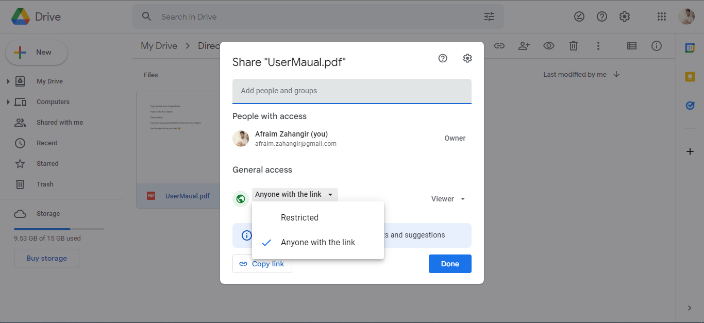
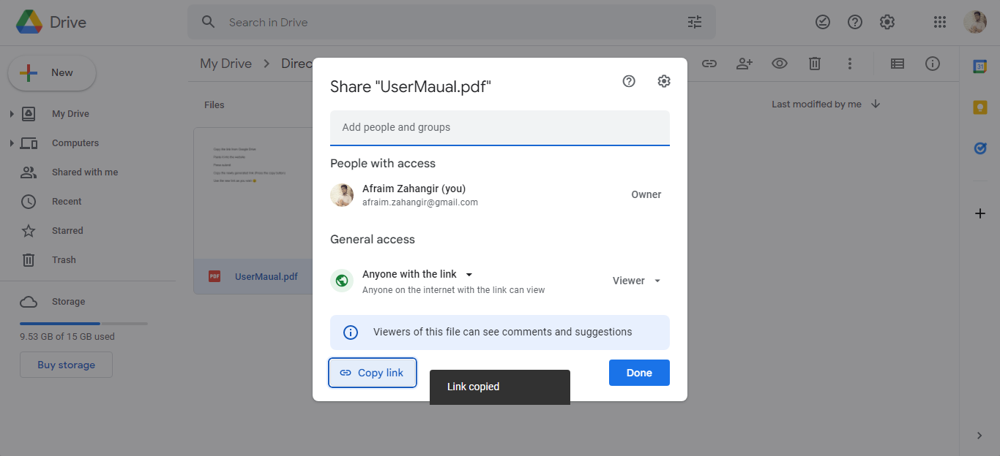
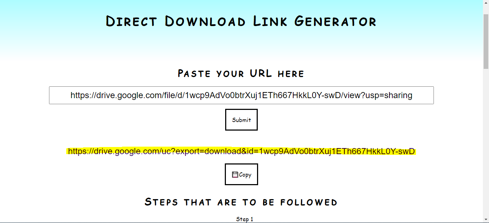
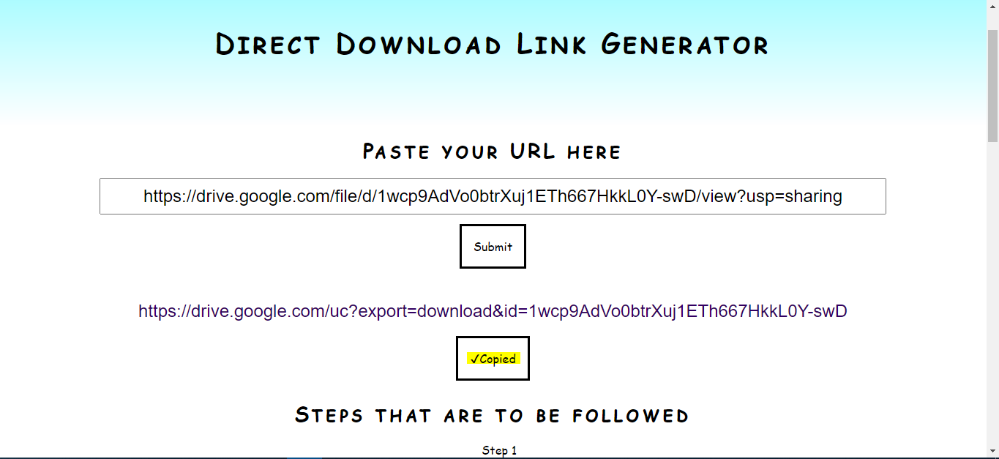

# gdrive2direct

When you share some files from our drive or we give a link to our own website for people to redirect, they are getting a Google drive view.
I do not like that. So what I do? As an Engineer, I solve the problems that I create 😁. 
I give you this Google Drive to Download Link website. Follow the simple steps shown on the main page and use the link as you feel. 
Send your next Resume from Google drive where your employer have to download your Resume to view it. Send cards to your firends and they have to download that.
Downloading means safe, secure, at fingure tips, no internet needed and also It shows that you can 😉.
If you want to contribute, feel free to visit the GitHub Repo. Hey don't steal ok, if I inspire you just give me a small (12px credit 😋).

## USE

## Images
#### STEP 1

#### STEP 2

#### STEP 3

#### STEP 4

#### STEP 5

#### STEP 6

#### STEP 7

## Contributing
Do not think it is needed but Pull requests are welcome. For major changes, please open an issue first to discuss what you would like to change.

Please make sure to update tests as appropriate.
